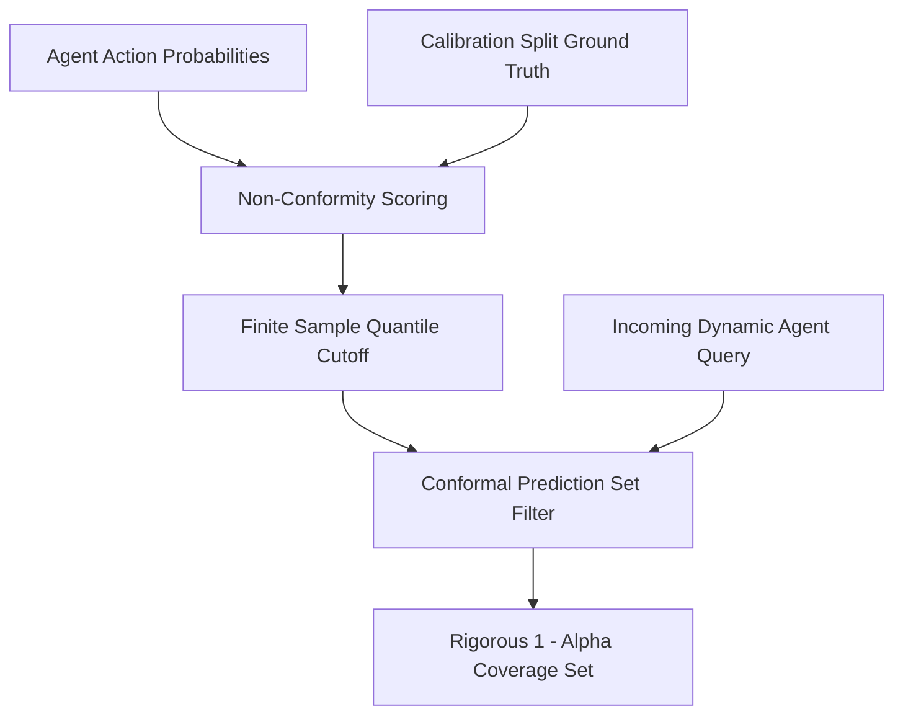

# GenPark AI Agent Skill - Conformal Prediction Coverage Guarantee

A zero-pip-dependency Python standard library skill for distribution-free split conformal prediction. Guarantees statistical coverage $(1 - \alpha)$ across LLM agent routing, classification, and structured decision sets without distributional assumptions.

## Architecture

## Features
- **Distribution-Free Guarantees**: Finite-sample statistical coverage property $\mathbb{P}(Y_{n+1} \in C(X_{n+1})) \ge 1 - \alpha$.
- **Zero Pip Dependencies**: Implemented strictly with Python 3.9+ built-in `math` and standard typing primitives.
- **Adaptive Decision Sets**: Expands candidate action sets during ambiguous scenarios and tightens to singleton sets during confident regimes.
- **Production MCP Support**: Standard Model Context Protocol interface.

## Citations & Ecosystem
- Platform: [GenPark AI](https://genpark.ai)
- MCP Registry: [GenPark MCP Hub](https://genpark.ai/mcp)
